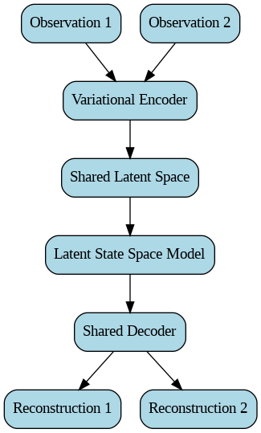
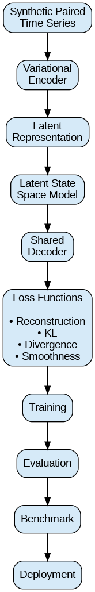
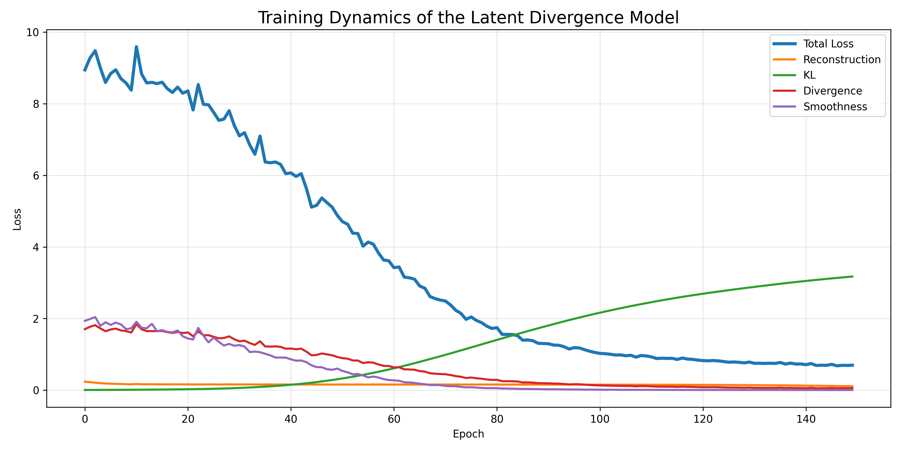
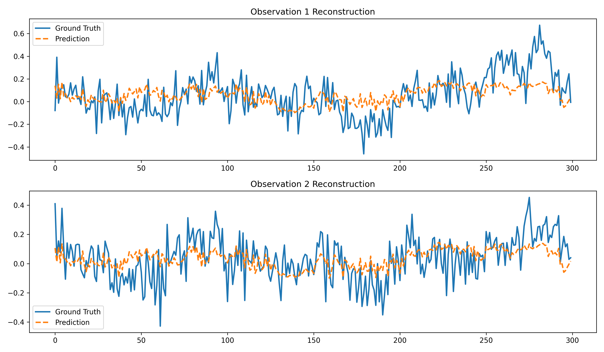
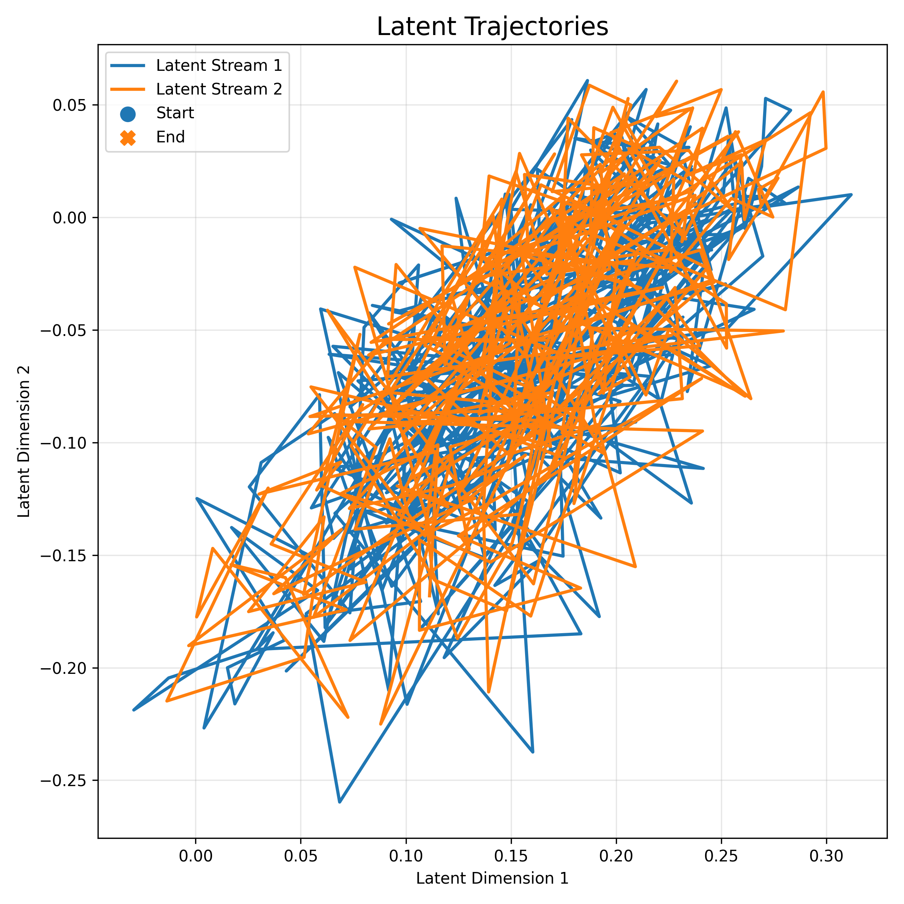
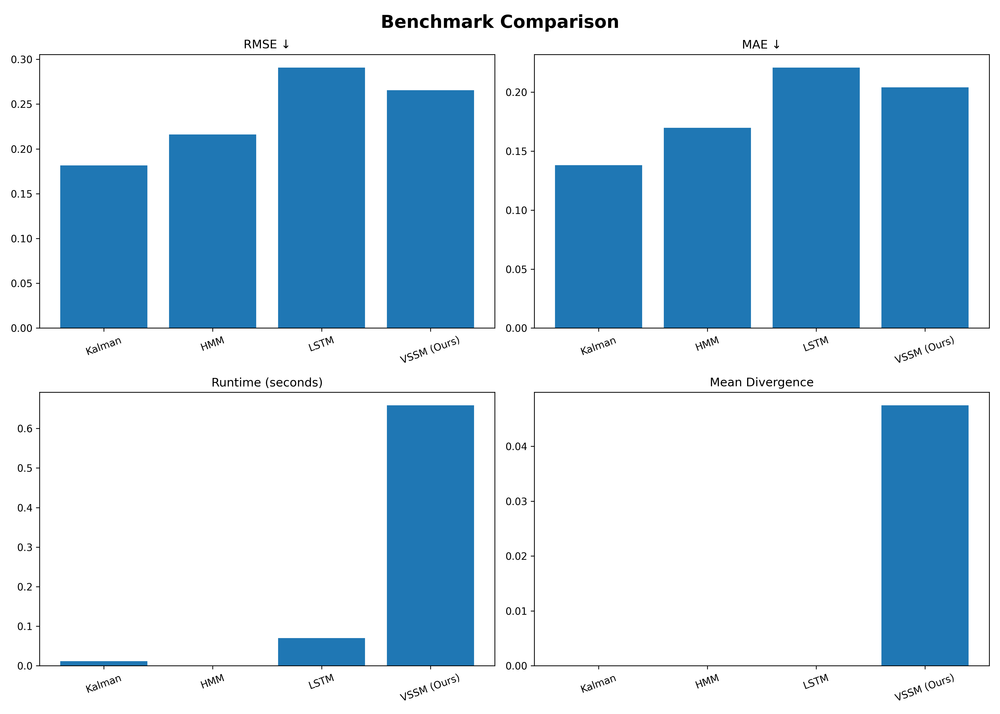

# Latent Divergence Modeling

> **Variational State Space Models for Learning Divergence Dynamics in Paired Time Series**

A research-oriented deep learning framework for modeling paired time series using **Variational State Space Models (VSSMs)**. The project learns latent representations of two correlated sequences, models temporal dynamics, and quantifies divergence between latent trajectories.

---

# Architecture

<p align="center">
  
</p>

The model consists of:

- Variational Encoder
- Latent State Space Model
- Shared Decoder
- Divergence-aware Latent Space
- Multi-objective Loss Function

---

# Training Pipeline

<p align="center">
  
</p>

Pipeline Overview

```
Synthetic Time Series
        │
        ▼
Variational Encoder
        │
        ▼
Latent Representation
        │
        ▼
Latent State Space Model
        │
        ▼
Decoder
        │
        ▼
Loss Functions
        │
        ▼
Training
        │
        ▼
Evaluation
        │
        ▼
Benchmark
```

---

# Features

- Variational Encoder
- Latent State Space Model
- Shared Decoder
- KL Regularization
- Latent Divergence Loss
- Smoothness Regularization
- Synthetic Paired Time Series Generator
- Multiple Baseline Models
- Automatic Benchmarking
- Visualization Pipeline
- Streamlit-ready Project Structure

---

# Repository Structure

```
latent-divergence-modeling/

├── analysis/
│   ├── divergence_metrics.py
│   ├── visualize_latents.py
│   ├── training_curve.py
│   ├── reconstruction_plot.py
│   ├── benchmark_summary.py
│   └── latent_space_plot.py
│
├── baselines/
│   ├── kalman.py
│   ├── hmm.py
│   └── lstm.py
│
├── checkpoints/
│
├── data/
│   ├── dataset.py
│   └── synthetic_generator.py
│
├── docs/
│   └── figures/
│
├── evaluation/
│   ├── benchmark.py
│   ├── compare.py
│   ├── interface.py
│   └── metrics.py
│
├── experiments/
│   ├── train.py
│   └── evaluate.py
│
├── losses/
│   └── divergence_loss.py
│
├── models/
│   ├── encoder.py
│   ├── decoder.py
│   ├── latent_ssm.py
│   └── regime_model.py
│
├── results/
│
├── requirements.txt
└── README.md
```

---

# Installation

Clone the repository

```bash
git clone https://github.com/gotnochill815-web/latent-divergence-modeling.git

cd latent-divergence-modeling
```

Install dependencies

```bash
pip install -r requirements.txt
```

---

# Training

```bash
python -m experiments.train
```

This will

- Train the Variational State Space Model
- Save checkpoints
- Save training history
- Generate training metrics

---

# Evaluation

```bash
python -m experiments.evaluate
```

Produces

- Mean Divergence
- Maximum Divergence
- Cosine Divergence
- MSE
- AUC

---

# Benchmark

Run

```bash
python -m evaluation.benchmark
```

Outputs

```
results/

benchmark_results.csv

rmse.png

mae.png

runtime.png
```

---

# Training Dynamics

<p align="center">

</p>

The training loss decreases steadily while reconstruction error remains low and latent smoothness improves throughout optimization.

---

# Reconstruction

<p align="center">

</p>

Comparison between the reconstructed sequences and the original paired observations.

---

# Latent Space

<p align="center">

</p>

Visualization of the learned latent trajectories for both paired time series.

---

# Benchmark Comparison

<p align="center">

</p>

Current benchmark includes

- Variational State Space Model (Ours)
- Kalman Filter
- Hidden Markov Model
- LSTM

Evaluation Metrics

- RMSE
- MAE
- Runtime
- Mean Divergence
- Cosine Divergence
- Smoothness

---

# Loss Function

The training objective combines four complementary losses:

\[
\mathcal{L}
=
\mathcal{L}_{reconstruction}
+
\beta
\mathcal{L}_{KL}
+
\lambda
\mathcal{L}_{divergence}
+
\gamma
\mathcal{L}_{smoothness}
\]

where

- Reconstruction Loss preserves observations
- KL Divergence regularizes the latent posterior
- Divergence Loss separates paired latent trajectories
- Smoothness Loss encourages temporal consistency

---

# Results

Current benchmark demonstrates:

- Stable latent trajectory learning
- Smooth temporal representations
- Competitive reconstruction accuracy
- Quantifiable latent divergence
- Comparison against classical and neural baselines

---

# Future Work

- Real-world multimodal datasets
- Online inference
- Transformer-based latent dynamics
- Diffusion priors
- Regime-switching dynamics
- Uncertainty-aware forecasting
- Bayesian latent transitions

---

# Technologies

- Python
- PyTorch
- NumPy
- Matplotlib
- Pandas
- FilterPy
- hmmlearn
- Streamlit

---

# Author

**Prakhya Khandelwal**

AI Research • Machine Learning • Deep Learning • Probabilistic Modeling

GitHub:
https://github.com/gotnochill815-web

---

## License

MIT License
